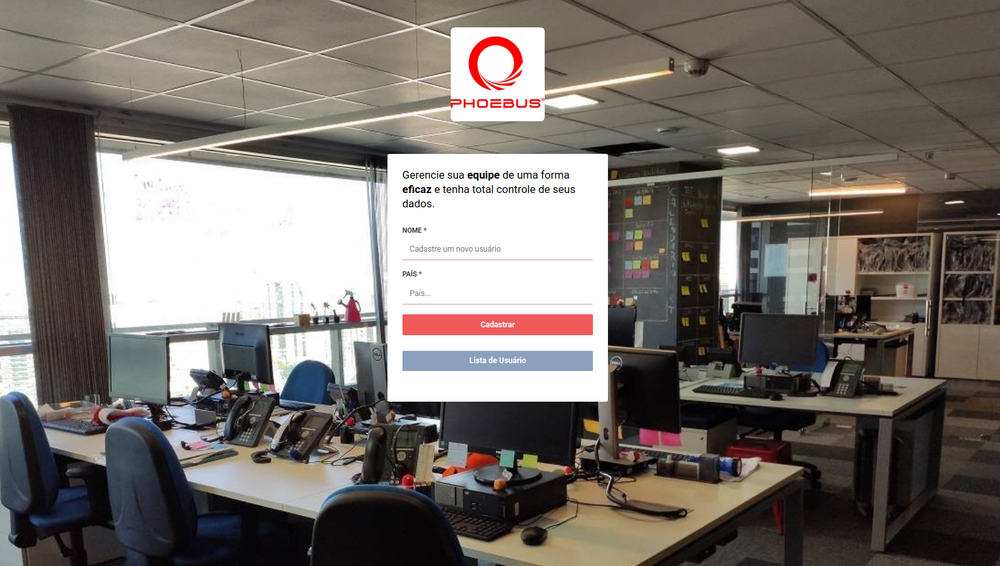
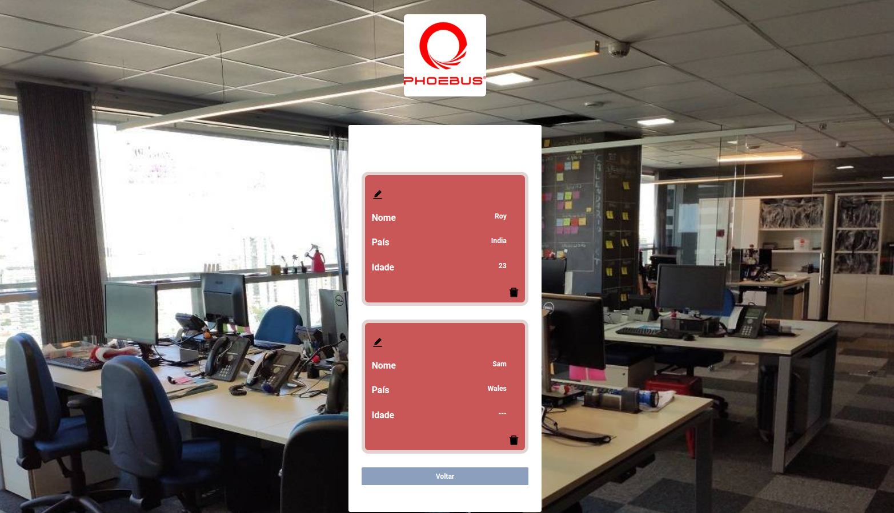
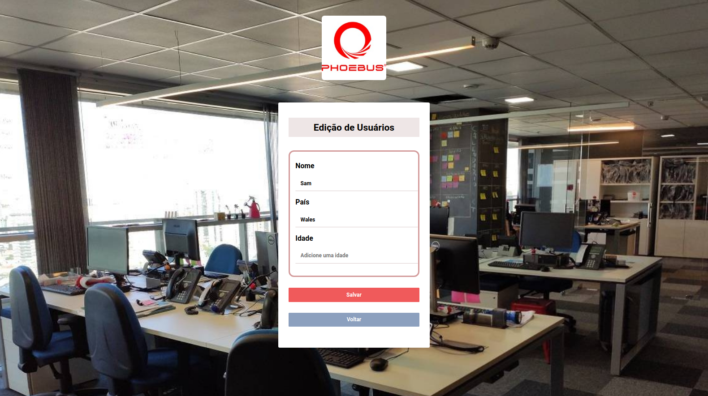
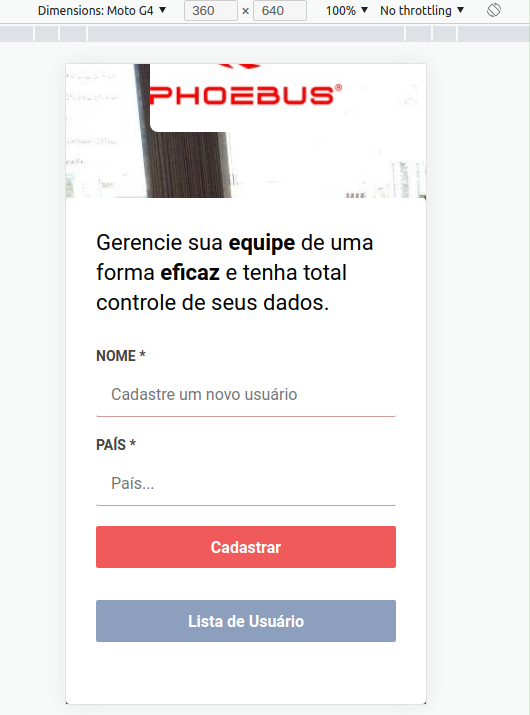
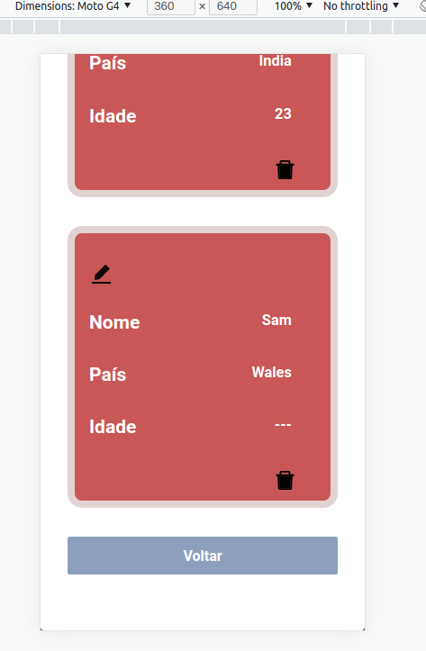
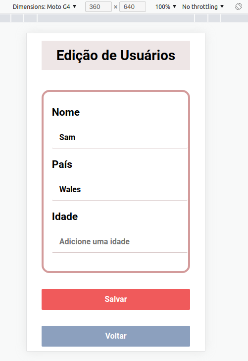

### O Projeto se trata de um sistema desenvolvido para uma empresa que pediu os seguintes requisitos: 
A empresa quer criar um *Gerenciador de Usuários.* Eles
querem armazenar essas informações em um *banco não relacional*, onde a sintaxe dos dados estão em formado JSON. Eles esperam que esse gerenciador tenha as seguintes
funcionalidades:

+ `Inserir um novo usuário.`
+ `Alterar um usuário existente.`
+ `Excluir um usuário existente.`

O diretor da empresa também deseja que seja criado uma funcionalidade para ser
adicionado a idade do usuário, uma vez que essa informação não existe no modelo
atual.

+ `Adicionar a idade do usuário.`

*JSON com os dados da empresa:*
~~~
{"users": [
{
"id": 1,
"name": "roy",
"location": "India"
},
{
"id": 2,
"name": "sam",
"location": "wales"
},
{
"id": 3,
"name": "bob",
"location": "Brasil"
},
{
"id": 4,
"name": "jeff",
"location": "Brasil"
},
{
"id": 5,
"name": "jean",
"location": "Brasil"
},
{
"id": 7,
"name": "maria",
"location": "Brasil"
}]
}
~~~

<h1 align="center">Tela Principal - Desktop</h1>

  

<h1 align="center">Lista de Usuários - Desktop</h1>

  

<h1 align="center">Edição de Usuários - Desktop</h1>

  

<h1 align="center">Tela Principal - Mobile</h1>

  

<h1 align="center">Lista de Usuários - Mobile</h1>

  

<h1 align="center">Ediçao de Usuários - Mobile</h1>

  

==========================================================================

### Information and commands used in the backend

(node version 12 above for mongoose usage)

1. `yarn init -y` 

2. `yarn add express`

3. `yarn add nodemon -D` -> -D siginifica dependecia de desenvolvimento q não vão para produção e com isso tive q add no package.json o obj:
####  "scripts": {
####    "dev": "nodemon src/server.js"
####  },
(Após isso é só rodar o projeto com `yarn dev`)

4. `yarn add mongoose` -> Ferramenta ou lib q vai facilitar trabalhar com o monogdb

5. `npm install cors` ou `yarn add cors` (Lembre-se q para usar o `yarn` precisa instalar globalmente) - (CORS protege sua API pra que niguém consuma sua API e roube seus dados)

#### AVISO: Há um erro que costuma dá no servidor chamado `TextEncoder` e o erro mostra a pasta q ele fica dentro do node-modules, a pasta se chama `whatwg-url` e a próxima pasta é `dist` e o arquivo é encoding.js, np arquivo adicione a var: `var util= require('util');` e coloque ela antes do TextEncoder assim: 
`const utf8Encoder = new util.TextEncoder();`
`const utf8Decoder = new util.TextDecoder("utf-8", { ignoreBOM: true });`
##### são duas const a serem alteradas

## In Node.js i used the technologies below:

+ Nodemon
+ MongoDB
+ Mongoose
+ Express
+ Routes
+ Path
+ Cors

### Frontend Information
## In ReactJS i used the technologies below:

+ Components
+ Routes
+ react-router-dom
+ Services API
+ Axios
+ History
+ LocalStorage
+ useState
+ useEffect
+ useMemo
+ CSS
+ Fonts
+ @material-ui
+ npm install react-icons --save <https://react-icons.github.io/react-icons>

#### 

npm install
npm run dev / npm d

#### ReactJS

npm install
npm run start / npm start